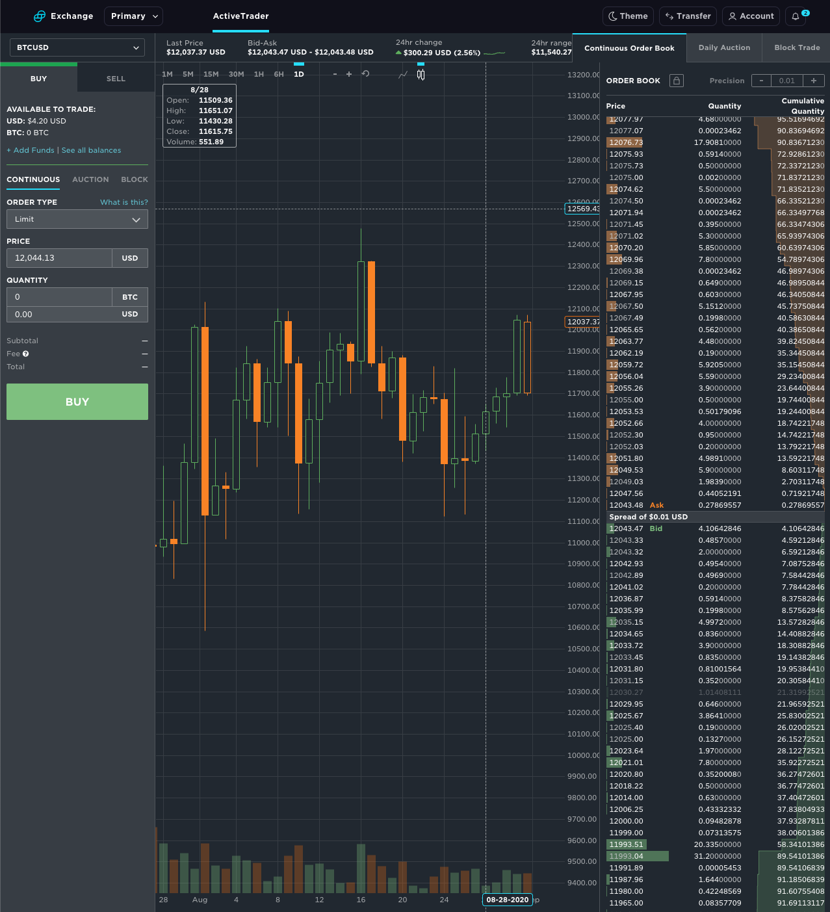

There's a lot I want to say about Crypto which I'll write about in future articles but, for now, I'll make this post short and sweet and explain how to get started

# Exchange

There are a ton of exchanges that exist today that allow you to convert your dollars to crypto think of how E\*Trade, Robinhood, TD, etc. are all entry points in to the stock market

It's the same idea for crypto and here are a few that I use

## Gemini

Gemini was started in 2014 by the [Winklevoss twins](https://en.wikipedia.org/wiki/Winklevoss_twins). Yeah, the guys who "started" Facebook, but besides that they've also gone on to [invest in a ton of successful startups](https://winklevosscapital.com/portfolio/) giving them more credibility

You can sign up [here](https://gemini.com/share/bvv79zh8). Full disclosure, this is my referral code and I get $10 of BTC if you trade $100

This has been my go-to exchange for a few reasons

### Deposit Limits

If you get verified with your address, ID, etc. you can get the daily ACH limit up to $15,000, but it starts at $500 and start trading immediately

There's no limit for wire transfer limits but they take 3-5 days to process, _banks... am I right_

### Withdraw Limits

If you need to withdraw your crypto (as you should never keep anything on an exchange longer than you have to, scroll down to hardware wallets) there is a $10,000 daily limit and $100,000 monthly limit

If you're hitting those limits well then clearly you're doing something right :)

### Fees

Just like in life, **there are no free lunches**

Every trade and transfer you make costs something

It should, someone is doing work to help you and you should repay that

The base fee is 0.25% for any trade e.g. $100 trade will cost you $1002.50, which is half as much compared to 0.50% on [Coinbase](https://www.coinbase.com/join/delgad_pc4) which, arguably, has a simpler UI and you're paying for convenience

The fee itself goes down as you trade more rewarding those who are more active on the app

You can read more about it [here](https://gemini.com/fees), but there's a lot and it's honestly confusing because most it will not apply to you starting off

### Safety and Insurance

#### FDIC Insurance

All of the USD you have on Gemini is FDIC insured up to \$250k like any other account you likely have

**The crypto you have (i.e. BTC and ETH) is not insuranced by FDIC because the government doesn't insure any digital assets**. No exchange will be able to offer you insurance on your crypto

#### 2 Factor Autentication

There's mandatory 2FA, I recommend using [Authy](https://authy.com/) on your phone to keep track of your 2FA in a single place. It's got a nice UI and plays really well with Gemini

Even if it wasn't mandatory I highly recommend keeping your financial life as secure as possible with 2FA

#### Hacks

So far there haven't been any large-scale hacks of Gemini which is promising, but I still repeat **do not keep your assets on an exchange**. When it's secured by _your_ private key that's when you control your own destiny

Leaving crypto on a centralized exchange makes for an easy point of attack for hackers and a very lucrative one given all of the money that's been funneling in to crypto

Some famous examples are [Mt Gox](https://blockonomi.com/mt-gox-hack/) back in 2014 that was handling 70% of all BTC in January and by February the exchange had gone bankrupt

A quick timeline goes as follows

- Launched in 2010 by Jed McCaleb, future founder of [Ripple](https://ripple.com/)
- Quickly becomes the most popular BTC exchange
- June 2011 it's hacked and 2000 BTC were stolen from customers and sold
- 2013 Mt. Gox re-establishes itself as the largest BTC exchange while the price of BTC reaches it's first peak of $1200 up from $13
- As it turns out Mt. Gox was never licensed in the US as therefore operating illegally and the US seizes \$5 million
- Feb 7, 2014 Mt. Gox stops all withdrawls claiming "to obtain a clear technical view of the currency process"
- Feb 24, 2014 all trading suspended and the website went offline
- Within that week a leaked internal document stated that they had been hacked and stole 744,408 BTC
- Feb 28, 2014 they declare bankruptcy

So yeah, don't fuck with that and just be extra careful which I address in the next post about [storage](/blog/crypto_here_to_stay_storage)

#### Cold Storage

They offer cold storage which is basically moving your crypto to a "safe" that has up to \$200 in insurance and 24/7 customer support

It offers you instant withdraws to the Gemini exchange, but you lose external liquidity and it's meant mostly for institutional investors so I don't use it, but if you're interested you can read more [here](https://gemini.com/custody)

## Coinbase

I have a Coinbase account that's also an exchange, but I rarely use it as the fees are higher, 0.5% vs 0.25% on Gemini

I will say that when starting off with crypto the deposit limits on either website are prohibitively low and getting your account verified takes a few days so having a few accounts setup at the same time actually makes sense that I'd recommend getting both while start off

You can sign up [here](https://www.coinbase.com/join/delgad_pc4), we each get $10 worth of BTC if you trade $100 of crypto

There are pros and cons to both websites which you can read about more [here](https://coincentral.com/coinbase-vs-gemini/)

The main difference to me is that Coinbase makes it seriously easy to buy that it's meant for beginners and a good place to start and as you start to understand how the world works you can move towards Gemini

# Conclusion

Many ways to enter the market, each with their own pros and cons

[Gemini](https://gemini.com/share/bvv79zh8), my preferred, is cheaper with a higher learning curve

[Coinbase](https://www.coinbase.com/join/delgad_pc4), favorite for the masses, is more expensive but way easier

Both work great and I'd sign up for both accounts today and see what works best for you and your existing crypto/trading knowledge

Next we'll talk about how to store your digital assets

Whatever you do, don't keep them on either Gemini or Coinbase

This is your money and not a joke

Seriously, fucking don't

I talk about storage in [Part 2](/blog/crypto_here_to_stay_storage)
