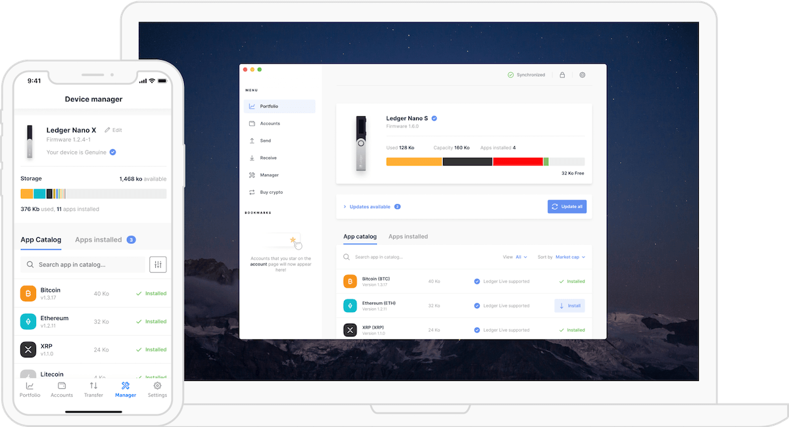
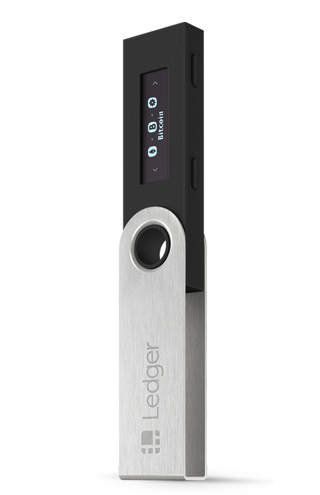
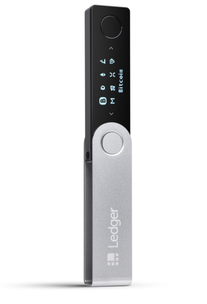

This is the second post in a short series about how, where, and why to store your virtual assets on a wallet that you control

If you want to learn about where to get crypto you can read about exchanges [here](/blog/crypto_here_to_stay_exchanges)

# Storage

When people are talking about storage with respect to crypto they're referring to a **wallet**

It's somewhat of a misnomer. A common misconception is that, unlike wallets for your dollar, a crypto wallet doesn't store your assets

Assets are not stored in any centralized place; instead they are on the blockchain that's stored on everyone's computer who has it downloaded

That's the beauty of decentralization, there's no single point of failure

Wallets provide a framework for you to interface with the blockchain network and access your assets

To interface with the rest of the world you have a **public address** which is a set of random numbers and letters for you to share to receive digital assets

Upon creation you'll also get a **private key** which is a separate set of random numbers and letters

Do not share your private key with anyone - _ever_

This is how you sign in to the wallet and can use it to access from any machine or to recover a lost one

There are a few types of wallets with different levels of security and convenience

## Web Wallet

This is the easiest type of wallet to setup and it's meant for beginners

It doesn't require any purchase, installing an application, or downloading the blockchain locally on your hard drive

All you need is a login - simple

It is easy, but it is not secure

I would not recommend using a web wallet to store your digital assets

As I've mentioned a few times, you want to **own your private keys**

**Do not** outsource them to a company which is then holding custody of your key and, therefore, has access to your assets

[Coinbase](https://www.coinbase.com/join/delgad_pc4), for example, is both an exchange and offers a web wallet, but I'd urge you not to use it as a wallet

Storing your digital assets with a single company opens you up to a single point of failure that is out of your control

It's happened before with [Mt. Gox hack](/blog/crypto_here_to_stay_exchanges#Hacks)

Many have paid a hefty price to learn that lesson the hard way

Leverage their knowledge so you don't have to

## Mobile/Chrome Wallets

These are the most common kind of wallets out there

They provide free and easy access on a device you always have with you

The difference between mobile and web is that you likely **own your private key**

Just because it's mobile doesn't mean that you **own the private key**

[Coinbase](https://www.coinbase.com/join/delgad_pc4) has a mobile app, but it is custodial and controls your assets

If you don't need it to trade, then I'd get it off as soon as you can because as the price of the digital assets increases

You'll treat mobile and Chrome wallets like cash

Keep just enough to spend here and there or move between accounts

As I've warned earlier there's always a risk and mobile wallets bear more risk than leaving your money at home

Some solid wallets are

- [Jaxx](https://www.jaxx.io/downloads)
- [MetaMask](https://metamask.io/download.html)

Depending on the coin you own, you may need a specific wallets

I'd recommend doing some of your own research through coin specific subreddits to find community defined best practices on how and where to store

## Hardware Wallets

This is crypto's version of keeping cash under the mattress

It's a physical device that has no connection to the outside world (no Wi-Fi) except through a phone or a computer

Unlike a smartphone or a computer it has a single function: hold your private keys securely

Even if your computer has malware the hardware wallet is built to keep your assets secure

You control the hardware wallets from either your laptop or your phone, but you'll need physical access to the hardware wallet

If you intend on holding any crypto get a hardware wallet

It costs between $60 and $150 which is a small price to pay for security, it's better to be safe than sorry

Many ask what happens if you lose the physical wallet

When you set it up you'll be provided with a 24-word recovery phrase

Write it on a piece of paper and store it somewhere safe, it should never enter the digital world

If you lose your device you can recover it by following the directions [here](https://support.ledger.com/hc/en-us/articles/115005297709-Export-your-accounts)

If you can, buy directly from the company's website itself so that you know it hasn't been tampered with

Peace of mind is worth it and I would not recommend skimping out on something that controls your finances

### Ledger

[Ledger](https://shop.ledger.com/?r=1b573d49e0e0) has two main wallets

#### Nano S - \$59

The [Nano S](https://shop.ledger.com/products/ledger-nano-s?r=1b573d49e0e0) is the cheaper of the two hardware wallets and does not have its own power source and must be plugged in to conduct any transactions

#### Nano X - \$119

The [Nano X](https://shop.ledger.com/products/ledger-nano-x?r=1b573d49e0e0) has a built-in battery and connects to your phone or computer via Bluetooth

You end up paying \$60 more for the convenience of using Bluetooth which I personally think has been worth it

# Conclusion

Storage is easy and there's one rule

**Own your fucking private keys**

Security and privacy isn't top of mind in today's day and age, but when you enter the world of crypto it should be

You, just you, are responsible for your finances

There's no customer service, no hotline, no get out of jail free card

Pure self-reliance and if there's a single entity you should trust in this world it should be **you**

I'm writing a followup post on how I've structured my financial world

It's built completely on top of crypto based companies

I'll explain why I've done it this way from both a safety and a passive return/investment strategy
