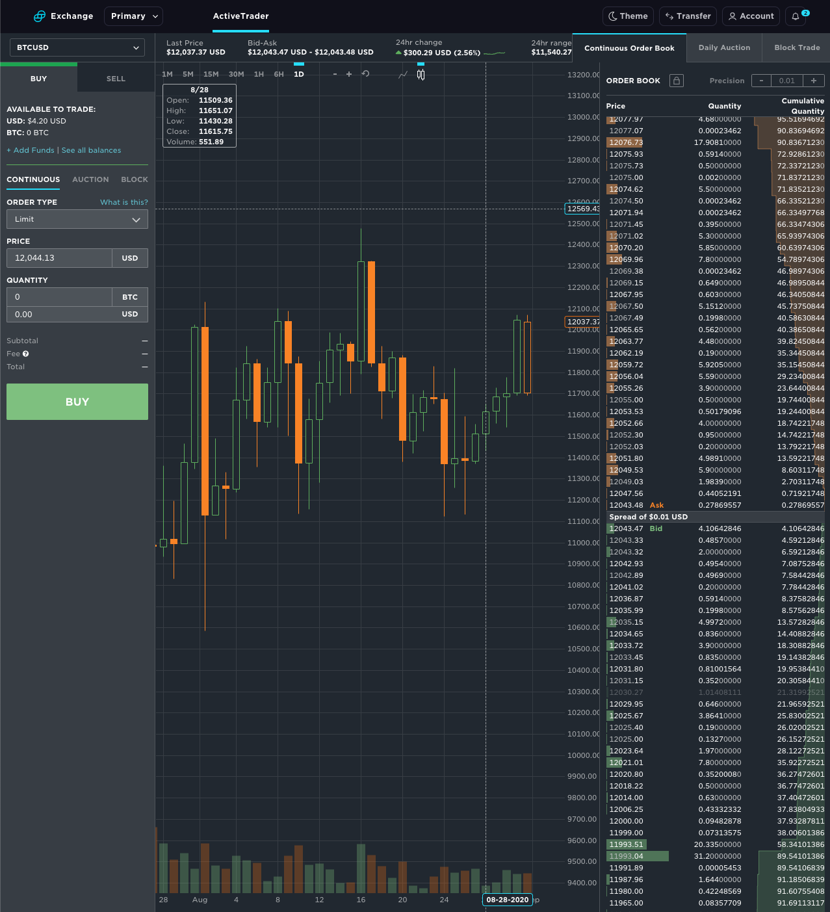
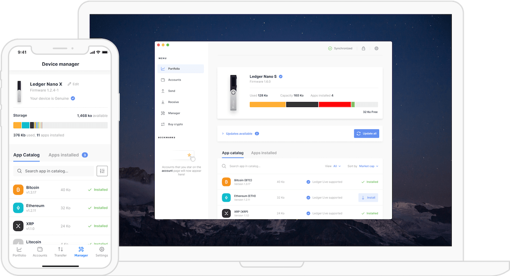

There's a lot I want to say about Crypto which I'll write about in future articles but, for now, I'll make this post short and sweet and explain how to get started

# Exchange

There are a ton of exchanges that exist today that allow you to convert your dollars to crypto think of how E\*Trade, Robinhood, TD, etc. are all entry points in to the stock market

It's the same idea for crypto and here are a few that I use

## Gemini

Gemini was started in 2014 by the [Winklevoss twins](https://en.wikipedia.org/wiki/Winklevoss_twins). Yeah, the guys who "started" Facebook, but besides that they've also gone on to [invest in a ton of successful startups](https://winklevosscapital.com/portfolio/) giving them more credibility

You can sign up [here](https://gemini.com/share/bvv79zh8). Full disclosure, this is my referral code and I get $10 of BTC if you trade $100

This has been my go-to exchange for a few reasons

### Deposit Limits

If you get verified with your address, ID, etc. you can get the daily ACH limit up to $15,000, but it starts at $500 and start trading immediately

There's no limit for wire transfer limits but they take 3-5 days to process, _banks... am I right_

### Withdraw Limits

If you need to withdraw your crypto (as you should never keep anything on an exchange longer than you have to, scroll down to hardware wallets) there is a $10,000 daily limit and $100,000 monthly limit

If you're hitting those limits well then clearly you're doing something right :)

### Fees

Just like in life, **there are no free lunches**

Every trade and transfer you make costs something

It should, someone is doing work to help you and you should repay that

The base fee is 0.25% for any trade e.g. $1000 trade will cost you $1002.50, which is half as much compared to 0.50% on [Coinbase](https://www.coinbase.com/join/delgad_pc4) which, arguably, has a simpler UI and you're paying for convenience

The fee itself goes down as you trade more rewarding those who are more active on the app

You can read more about it [here](https://gemini.com/fees), but there's a lot and it's honestly confusing because most it will not apply to you starting off

### Safety and Insurance

#### FDIC Insurance

All of the USD you have on Gemini is FDIC insured up to \$250k like any other account you likely have

**The crypto you have (i.e. BTC and ETH) is not insuranced by FDIC because the government doesn't insure any digital assets**. No exchange will be able to offer you insurance on your crypto

#### 2 Factor Autentication

There's mandatory 2FA, I recommend using [Authy](https://authy.com/) on your phone to keep track of your 2FA in a single place. It's got a nice UI and plays really well with Gemini

Even if it wasn't mandatory I highly recommend keeping your financial life as secure as possible with 2FA

#### Hacks

So far there haven't been any large-scale hacks of Gemini which is promising, but I still repeat **do not keep your assets on an exchange**. When it's secured by _your_ private key that's when you control your own destiny

Leaving crypto on a centralized exchange makes for an easy point of attack for hackers and a very lucrative one given all of the money that's been funneling in to crypto

#### Cold Storage

They offer cold storage which is basically moving your crypto to a "safe" that has up to \$200M in insurance and 24/7 customer support

It offers you instant withdraws to the Gemini exchange, but you lose external liquidity and it's meant mostly for institutional investors so I don't use it but if you're interested you can read more [here](https://gemini.com/custody)

## Coinbase

I don't use Coinbase often as I try to stick to a single exchange and the fees are higher, but because limits are pretty low until you get verified I have an account there too

You can sign up [here](https://www.coinbase.com/join/delgad_pc4), we each get $10 worth of BTC if you trade $100 of crypto

# Wallets

A common misconception is that a wallet actually stores your assets

They're not designed to store digital assets, they provide a framework for you to interface with the blockchain network

You'll get a _public address_ which is a set of random numbers and letters for you to share with the world to receive funds

You'll also get a _private key_ which is also a set of random numbers and letters. **Do not share this with anyone - ever**. This is how you sign in to the wallet and can recover it from any machine if you lose your device

There are a few types of wallets

## Web Wallet

This is the easiest wallet to setup and meant for beginners

It doesn't require any purchase, installing an application, or downloading the blockchain locally on your harddrive

All you need is a login - simple

It is easy but it is not secure

I would not recommend using a web wallet, as I've mentioned a few times you want to own your _private keys_

**Do not** outsource them to a company which is then holding custody of your key and therefore access to your assets

[Coinbase](https://www.coinbase.com/join/delgad_pc4) is both an exchange and offers a web wallet if you so care, but I urge you, for once in your life, don't be lazy and move it off of web wallets as they're only safe until they're not and the have been a ton of them that have been hacked

## Mobile/Chrome Wallets

The most common kind of wallets out there, easy access on a device you always have with you

The difference between mobile and web is that you likely own your _private key_, just because it's mobile doesn't mean that you do

For example [Coinbase](https://www.coinbase.com/join/delgad_pc4) has a mobile app, but it is custodial and controls your assets get it the fuck off if you don't need it to trade on Coinbase

You'll use mobile and Chrome wallets like cash, you'd keep just enough to spend or move around here and there. As I've warned earlier there's always a risk and mobile wallets bear some risk just like losing your cash

Some solid wallets are

- [Jaxx](https://www.jaxx.io/downloads)
- [MetaMask](https://metamask.io/download.html)

Depending on the coin you own you may need a specific wallet, but there are a few more widely accepted ones that you can search through coin specific subreddits for

## Hardware Wallets

This is equivalent of keeping cash under the mattress for crypto

It's a physical device that has no connection to the outside world except through a phone or a computer

Unlike a smartphone or a computer it has a single function: hold your private keys securely

Even if your computer has malware the hardware wallet is built to be safe

You control the hardware wallets from either your laptop or your phone

If you intend on holding any crypto, get a fucking wallet

It costs between $60 and $150 which is a small price to pay for security, it's better to be safe than sorry

Always buy directly from the company itself so that you know it hasn't been tampered with

Again, peace of mind is worth it and not something you want to skimp out on

### Ledger

[Ledger](https://shop.ledger.com/?r=1b573d49e0e0) has two main wallets

### Nano S - \$59

The [Nano S](https://shop.ledger.com/products/ledger-nano-s?r=1b573d49e0e0) is the cheaper of the two hardware wallets and does not have it's own power source and must be plugged in to conduct any transactions

### Nano X - \$119

The [Nano X](https://shop.ledger.com/products/ledger-nano-x?r=1b573d49e0e0) has a built in battery and connects to your phone or computer via bluetooth

You end up paying \$60 more for that convenience which I think has been worth it

# Conclusion

That's a quick run down on how to get started on buying and storing your digital assets

Key point being **own your fucking private keys**

Security isn't something you think about until it's too late, don't let that happen

Others have made the mistakes so you don't have to, learn from their lessons

I'm writing a followup post on how I've structured my financial world

It's built completely on top of crypto based companies

I'll explain why I've done it this way from both a safety and a passive return/investment strategy
