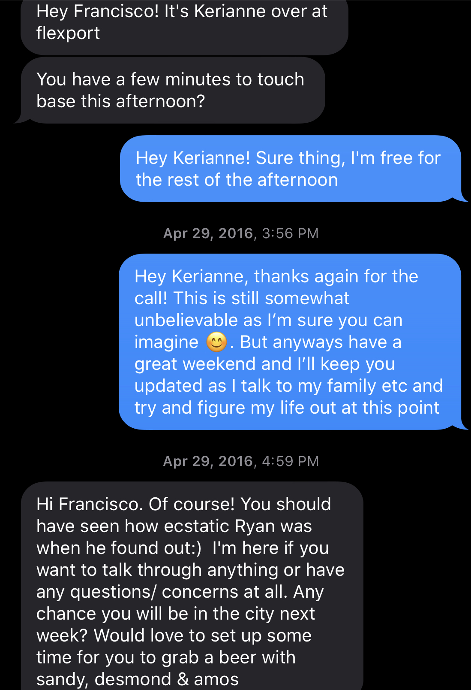

**TLDR; If you want the classic goodbye on what I'm doing next and how to keep in touch feel free to just read the first one. If you'd like an honest goodbye with my thoughts from my time here feel free to read the rest.**

# Classic Goodbye

I lied in the email subject. I was a few months shy of four years, but, you know, marketing.

I’d like to start with the obvious. It's been a pleasure working with you all. The best years of my life by far and I owe a lot of that to Flexport and all of you who make it the company it is.

The first question that always pops into my head when someone leaves is what they’re doing next so I hope this satisfies your curiosity. These are my rough short term and long term plans

## Short Term (3-6 months)

It’s up in the air if I'll stay in SF when my lease ends in September. Given all of the restrictions due to COVID I’m testing a more communal living style outside of the city. The idea is that I take some of my friends who are able to work remotely and move to the suburbs or the mountains and quarantine together somewhere that’s

1. Cheaper
2. Larger
3. Has fewer restrictions
4. Less dangerous

I’m currently outside of Vegas as I take a first step to testing this idea. I rented a giant house with twelve friends for two weeks. We’ll see how well we’re able to function in a communal environment (shared food, shared costs, optimize for the group and not the self) while maintaining productivity. Assuming it goes well we’ll re-evaluate once the lease ends if we want to negotiate for lower rent, move within SF, or move somewhere we could get more space for the time being (I’m pushing for the latter).

While figuring that out I plan to do anything so that I can be financially self-sufficient. Figure out any way I can to make money on my own so I can extend my personal runway. Continue to expand my [Amazon FBA business](https://smile.amazon.com/Fradel-Digital-Kitchen-Scale-Bowl/dp/B07W3KXZR9) (look familiar? :P), continue writing my thoughts on the world, working with friends to help them monetize their side hustles, angel investing, bootstrapping a few ideas I’ve had over the last year, and really anything else that comes my way.

## Long Term (6+ months)

Assuming I'm no longer burning cash I have a few ideas with some friends I'm going to start pursuing seriously. Right now most ideas revolve around remote work, an exodus from cities, making friends online, video chatting curated for a niche, and the idea that everyone can and should be a content creator. I’m still figuring out where I want to enter this market from, but odds are I’ll end up applying to YC with an idea in this space.

Up until this point I've lived my life way too calculated.

> I’d try to plan out my life years ahead and work everyday towards that goal. I was so focused on hitting a goal I had set years before I’d forget to re-evaluate my options as the world around me changed and, ultimately, I changed.

I hadn’t been living in the moment. I'm looking forward to living a more flexible lifestyle with time to work on my passions until I find that one idea that I can't stop thinking about and that's when I know it’s time for me to commit.

If you want to keep in touch

1. [Instagram](https://www.instagram.com/francistogram/) - where I share just about every aspect of my life
2. [Twitter](https://twitter.com/francistogram) - shortfrom thoughts on the world
3. [Blog](https://francistogram.com/blog) - longform thoughts on the world, philosophy, and documenting what I'll be doing
4. **XXX-XXX-XXXX** - if you wanna chat shoot me a text
5. **XXXXXXXX@francistogram.com** - shoot me an email if ya tryna be profesh

**Last day:** July 3rd, my calendar is open to you all if you’d like to say goodbye

# Honest Goodbye

I opened up the #general channel and scrolled through the list of all of the members and anyone whose name made me stop for a split second I bcc’d to this email, trusting my gut on this one. Everyone who is receiving this email has impacted me in a different way varying from directly working together, crossing paths briefly as I visited another office, never working together and just knowing each other socially, or even people I knew from before Flexport and our relationship has changed since working together (for better or worse).

I ended with a list of 280 people, roughly fifteen percent of the company, and all of you have, in one way or another, played a role in my journey at Flexport and I hope for many of you we continue to stay in touch even if our paths, from here, begin to diverge.

Anyways, here’s my story and three lessons I’ve learned over the years here.

Leaving Flexport has been the hardest decision I've had to make in my entire life, this is not a hyperbole. The same way relationships often go longer than they should because we’ll remind ourselves of the initial spark, how happy we had been, and how much potential we see in this person... that's how I feel about Flexport. Sunk cost fallacy doing what it does best. I often wonder how much of a better place the world would be if we could somehow stop humans from acting on the fallacy, but it seems to be a reality of life.

I’d like to start a few months before joining Flexport as that’s where this story really began for me.

I began working at LinkedIn near the end of 2015 working on nothing. Not literally nothing, just nothing of value. I was given tasks so repetitive and cumbersome it made more sense for me to automate my own job and so I wrote scripts to do exactly that.

**Everyday was the same.**

Bike to work. Run the script. Workout. Breakfast. Run the script. Lunch. Run the script. Ping pong. Run the script. Workout. Bike home.

I got into the best shape of my life, ate the best food I’ll ever eat, made great friends, but three months was enough for me to realize how boring life would be without a challenge. I thrive off of curiosity and no amount of money or perks could convince me to stagnate and I considered applying for jobs. I need intellectual stimulation - my preferred form of entertainment.

Around the same time these thoughts began to enter my mind I received an email.

“Let’s Transform Trade”, read the email subject.

I clicked in. “Flexport?”, I questioned.

I had never heard of Flexport and neither had my friends. I had too much pride to work at no name company. I marked the email as read, left it in the graveyard of thousands of other emails I’d refuse to delete for the infinitesimally small chance I’d need it someday, and continued on with my life.

A few more weeks and the repetitive schedule began taking a toll on my mental health and I needed out. I began interviewing passively. Combing through all my recruiting emails I came across Flexport’s email again and reread it. I was a sucker and fell for the clickbait title [The Unsexiest Trillion-dollar Startup](https://techcrunch.com/2016/06/07/flexport/). Maybe this was the change I was looking for. The article sold me on the future and I set up an interview and a few weeks later made it to the final round.

I left the interview thinking how well it went, how much I enjoyed all of the interactions, and began to imagine my life at Flexport. To my surprise, a few days later, I received a rejection email. All of the life plans I came up with the last few days begin to crumble. The plan I had just come up with was so broken that I decided against my better judgement and was set on staying at LinkedIn to try and make it work.

A week later I received a text from Kerianne, my recruiter, asking if I’m free to talk. Of course I’m free the rest of the afternoon, I didn’t do any work at LinkedIn, but I wasn’t going to admit that.

She called me to tell me that they changed their minds and wanted to extend me an offer. A good reminder how important it is to admit mistakes when they're made and to go back to fix them before it’s too late.

I stayed a few more months to finish off my year at LinkedIn and joined Flexport in Sept 2016. I started working without knowing anything about Javascript, React, Rails, web development, databases, product development, really anything concrete of value to Flexport. CMU didn’t teach me any of the practical applications, just the theory. Although, I’d argue that’s where I learned something more important, that's where I learned how to solve any problem.

## First Lesson

A few months in and I felt like a fraud for months. Imposter syndrome peaking. I came in knowing close to nothing and having to learn everything at the same time in an environment where change was the only constant. A lack of strong experience combined with my natural desire to avoid conflict resulted in silence from me in most discussions and meetings.

Enter Chase Brownell. We were strangers but we were both CMU alumni different years, joined Flexport a few weeks apart, he was a few years ahead in his career, and I was always impressed with how he was always thinking multiple steps ahead of where we were as a team. One day, while working on a plan for a project, the two of us met at a whiteboard to decide the pros and cons to options we were considering. Upon deciding on an option I left feeling as though I hadn’t added much to the decision, but as we walked back to our desks he turned to me and said, "You should speak up more, you have really good ideas".

That was an inflection point in my life.

I started speaking up in meetings more, pushing back on ideas/projects I didn't agree with, I felt as though I finally realized that, when done tactfully and in good faith, radical candor was the optimal long term approach.

> Bring others up with you. You may not even remember or notice that you did or said something, but there's a good chance that small action you made had a huge impact on someone's life.

## Second Lesson

I've never been the type of engineer who is reading the front page of HackerNews and trying the newest technologies, it's not who I am nor what interests me. Programming I enjoy as a means to an end.

The end I’ve always been looking for has been making people happy.

The beauty and potential I saw in Flexport was that I could personally talk to ops, understand their issues, solve their problem, and then for me the enjoyment came when I could see first hand how much it helped them. **I don't think we take advantage of this at all. We are in such a unique position compared to most other companies and yet we don't encourage or facilitate cross-pollination between orgs and teams at the IC level as much as I believe we should.**

For years I was working on the Client App team and, at the same time, combing through the #bugs and #product channel responding to as many issues as I knew I could solve. Naturally it led me to building some friendships with those in operations, often closer ties than those I had with my fellow engineers. They felt as though they could ask me for help and wouldn't be insulted if I said I didn't have time as they knew that all I wanted to do was help them. It's what gave me an advantage to determine when something was worth working on based on how often I had seen the request and their honesty when it came to priority.

That insight was what encouraged me to push so hard for the creation of the Squad Tools team. I saw the power of having a tight bond between users and those who can help them. A bond built on trust and mutual understanding. My ask for the team came from both a personal preference for working in that environment, but also because I believed it to be the right step for Flexport to get us to the next level as a company. It's all I wanted over these last few years. It took longer than I would’ve liked to come to fruition, but better late than never.

> The best ideas are those that you’ve convinced yourself of its potential while being able to understand why everyone else can’t see what you see. Execute on those. No matter how long it takes.

## Third Lesson

Fast forward to a year and a half ago. As the company grew the opportunities to interact with those outside of my team started to shrink. It's the natural change as a company grows and I kept fighting it. I could no longer continue to meet every new engineer, those in operations, or, simply put, my time did not scale with our rate of growth. The result was my role getting further and further removed from _why_ we're building something and more and more focused on _what_ we're building.

I began to lose my motivation driven by the ability to personally see the impact of my changes. I stuck around anyways. I was financially invested in the company as a shareholder, emotionally invested with all the friends I've made, and had more time left to vest all the equity from my initial grant.

The breaking point was when I finally did the math recently. I didn't need the money, I just wanted more money. I continued to question myself.

What were my goals?

In what timeframe?

What did I want to accomplish?

Would it fundamentally change my life?

**Would it make me happier?**

What I finally realized a few weeks ago was that the relationship Flexport and I had was no longer a net positive from either perspective. I was more passionate about my personal projects than with work and was fighting a losing battle with my motivation. On the other side I believed it also to be sub-optimal for Flexport. They could take my salary and equity and hire a new engineer who would be more passionate and work harder than I was.

As a shareholder in Flexport and, more importantly, myself, the decision had never been clearer. I knew it was finally my time to pass on the torch to the next generation.

> While incentives guide your actions, intrinsic motivation is the only forcing function that withstands the test of time.

# Final Thoughts

These have honestly been the best four years of my life. I've grown more as a person than I ever had before, in any time frame. I owe much of it to Flexport. I've met some of the most amazing people here. Some of my best friends are here and I hope nothing but the best for all of you. Finally, some of my favorite memories from working here in no specific order

- Visiting the LA office and being welcomed with open arms as a stranger and their offsite in Malibu
- Working in Amsterdam for the first hackathon and going out dancing with the team until 2am
- Celebrating Taco Tuesday with Natalie trying to bring together ops and makers
- The yearly SF tubing trip I’d plan with Franni
- The good 'ol late nights in the Customs pit. We'd stay until midnight half working, half shooting the shit all while enjoying the company of those around us
- Visiting the Shenzhen and HK office and spending a few too many nights out in LKF
- The crypto pump when the #crypto channel was so active and I'm sure many of us considered if we even needed a day job anymore (RIP that money lol)
- Going to Orlando for Grace Hopper
- Clubbing in Toronto after recruiting from Waterloo
- Starting the PO team, customs team, client app team, and squad tools team and being given the opportunity to understand so many different parts of the industry and coming to the realization I really knew close to nothing. When I first started doing my Amazon FBA business I realized how little I know about the specifics and was too embarrassed to hire Flexport as my forwarder to not out myself and went with some other random company I found online. That was a rough realization hahaha
- Franni organizing the Makers beanie baby Halloween costume and the 101 Dalmations and surprised us when she dressed up as Cruella De Vil
- The 5MM boat party the July before I joined and the after party at Ryan's house. I remember thinking, "This is the startup life people always talk about"
- People playing beer pong in the kitchen after my first day of work
- Watching the sunset with a beer in hand on the roof of 730 Market Street
- Being part of the culture committee and given a budget to host whatever weekly events in the name of cultivating community (the job that I dream about lies in this realm somewhere)
- Watching my idea (bulk document downloader) come to fruition and then hearing a client say it was their "Wow Moment" when it came to using Flexport

If you'd like to talk before **my last day on July 3rd** just shoot me a text or Slack me and happy to hop on a call.

It’s likely I forgot a few people. I met _a lot_ of people over the years so if I forgot someone I promise it wasn't personal and feel free to forward them the email.

In case you're wondering. Yes, I’ve exercised 75% of my vested options. I'm still very, very bullish on Flexport.

Mike Chen said it best in his goodbye email

> Try to keep the original spirit alive if you can, but know that you're fighting a losing battle. Try not to feel bad about it, and instead accept the reality. Given the rate of growth at Flexport, I don't think I would have ever survived my full four years. There are significantly worse problems to have than to be part of a company so successful that it outgrew you too quickly.

All things must come to an end. I played out my role here the best I could and now it’s up to all you to continue propelling Flexport forwards.

I wish you all the best and, as they say, I'll be rooting from the sidelines.

See you all at IPO :)

**PS. If you enjoy my writing, my thoughts, and want to keep up with my life I’d appreciate it if you signed up for my [mailing list](http://eepurl.com/g77duP).**

Your friend,

**Francisco Delgado**, Culture Enthusiast

XXXXXXXX@francistogram.com

+1 XXX.XXX.XXXX
