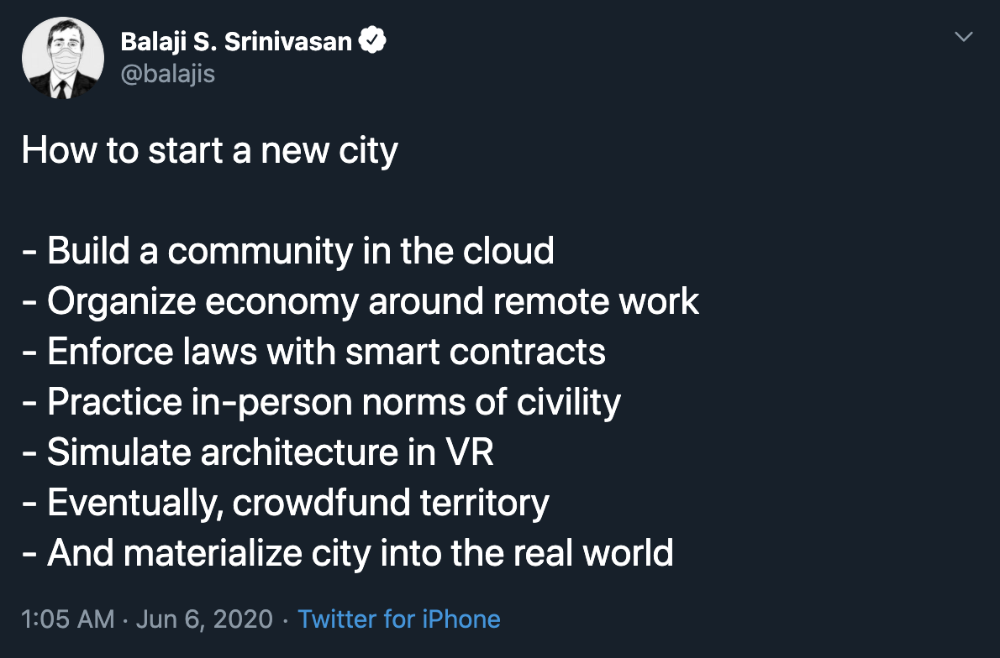
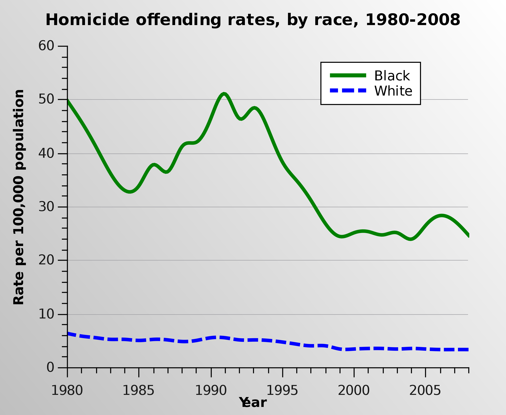
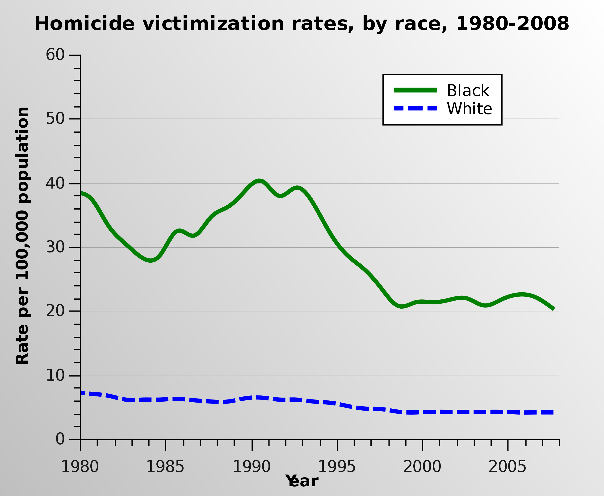
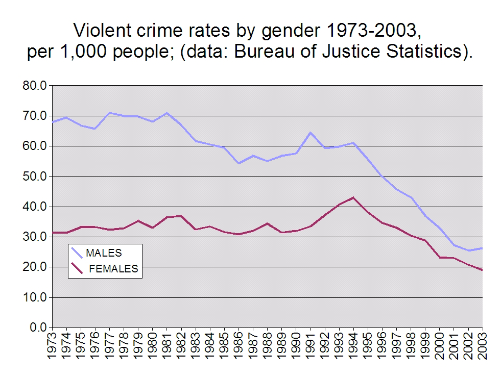

# Apollo - Our Moonshot Application

I'm applying to [Apollo's Moonshot Program](https://apolloprojects.com/)

In an effort to be fully transparent with my intentions below is the application that I will send in on 7/11

If you have any edits to suggest I'd appreciate hearing them

#### This is as much my community as it is yours

### What I'm Building

I'm in the process of building a community in the cloud

Eventually, we materialize in to the real world as a charter city

I'm roughly following the outline [@balajis](https://twitter.com/balajis) has [laid out](https://twitter.com/balajis/status/1269178671086006273)

I'm beginning on step two, mostly done through my [Instagram stories](https://www.instagram.com/francistogram/)

### Why is it Valuable

The US, while admittedly imperfect, has brought a lot of good in to the world

She's created opportunities for many. The values she was created on have allowed for those with motivation, self-confidence, and a unique taste for risk to uproot their lives to join her for the chance of lifting themselves, their families, and their community back home out of the system keeping them down

In 2020 we seem to have lost sight of our founding princple of **Freedom**

It's becomes a conflict between "good" and the "bad" instead of, through civil discourse, figuring out what is beneficial for the entire community

If you look at the data, besides this year, the world has never been safer

Crime, on aggregate, is significantly down and yet the media portrays this narrative that everyone is at each other's throats

It seems to stem from a misguided understanding that two facts can be simultaneously true

1. Horrific injustices continue to exist in the world
2. As a society, we have been actively chipping away at those horrific injustices

This data is from the US Bureau of Justice Statistics on the [Crime in the United States](https://en.wikipedia.org/wiki/Crime_in_the_United_States) Wikipedia Page

Don't misinterpret my intentions. This doesn't mean we should stop fighting the good fight

Rather, my suggestion is that instead of having the delta in difference between the "Haves" and the "Have Nots" trigger emotions of jealousy we should let it inspire the world to come together

**Together.**

That's how we solve this

The current divide has allowed so many of us to forget that we have so much "good" in our lives

We've forgetten our family, friends, and, particularly, the community in which we exist that will love us unconditionally and catch us if we fall

I want to create this city as a safe haven for those in my community

When this house of card collapses I want to have the infrastructure built so that my community has somewhere to escape to

A landing pad for safe landing and a launch pad for future success

I want to be the colonizer that leaves the world they know today and to start the next one

The rebirth of the United States if you will

Safety is short term goal

**Equity** - for everyone - is the long term goal

### Why did I Decide to Work on This

My entire life I've always been the center of my friend groups. This is true of high school, college, and work, but most evidently in the "real" world - the life I'm living now that I've quit my job a week and a day ago.

My first day of "real" **Freedom** was July 4th, just a coincidence I'm sure

**Freedom**: The ability to choose our own commitments, not the absense of them

I've finally tasted real **Freedom** I want to share it with the rest of the world or at least those who want it

Within the confines of the structure defined by these institutions I was able to influence culture and build a semblance of a community

It was not, what I'd define as, a success

**Success**: The community I and the rest of those in it want, not just what those in power want

The problem I believe to be the process. When structure is decided top down, on a long enough time frame it will crumble for one reason or another

Without openly considering feedback, both positive and negative, from those the policy affects it will always be imperfect

I want to build culture, a community, a city, a company, whatever you want to call it from the bottoms up

The grass roots approach

A community based on trust

It _has_ to, by definition, take a while to build

It cannot be done quickly

**Trust: Consistency over time**

There's no get rich quick schemes and there's no to build trust quickly schemes

Luckily, my skill has always been connecting people together and I'm finally letting myself own it

Whether I realized it or not, I've been working towards this my entire life

Building relationships and friendships while expecting nothing in return

It's now time I spend that social capital

I spent my time on them and maybe they will want to spend their time on me

> Would you like to join my city?

I offer to the world

The decision. Well that is theirs - not mine

_fin._
