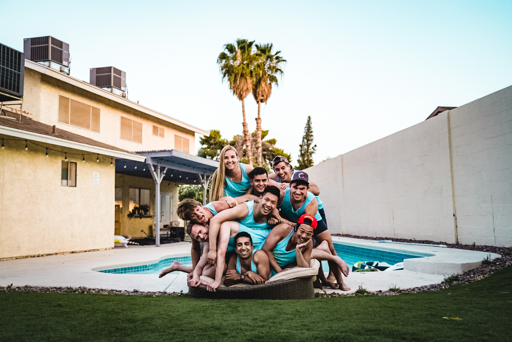

# Apollo - Our Moonshot Application

I'm applying to [Apollo's Moonshot Program](https://apolloprojects.com/)

In an effort to be fully transparent with my intentions, below is the application that I will send in on 7/11

If you have any edits to suggest I'd appreciate hearing them

#### This community is as much yours as it is mine

## Living Document

This post will continue to be updated as I make more progress and refine the idea

I've open sourced my blog and every change can be viewed [here](https://github.com/francistogram/francistogram/commits/master/content/blog/moonshot_our_city/index.mdx) if you'd like to see how the idea has evolved

## What We're Building

We're in the process of building a community in the cloud

Find like minded people across the world who hold similar values

Work together remotely to build trust in each other and the community

A foundation of trust results in the best chance of success

Eventually, we materialize into the real world as a charter city

## What We've Built

We're following the strategy [@balajis](https://twitter.com/balajis) has [laid out](https://twitter.com/balajis/status/1269178671086006273)

### Create an Instagram Community

Step one and two have mostly done through my [Instagram stories](https://www.instagram.com/francistogram/)

Instagram stories are the ideal place to cultivate a safe and social environment

#### 1. Number of Followers

I have ~1500 followers built up over the years between friend's I've made and, for a year, thinking I wanted to be a photographer with a following

I believe around 1500 to be the sweet spot

Too many followers and others will follow because of the social validation

Too few followers and others will quickly assume you provide no value

Having somewhere between 1000 and 2000 forces those on my profile to come to their own conclusion

They have to ask themselves if I provide enough value to justify a follow

#### 2. Degrees of Separation

Everyone is one degree of separation away from me and at most two degrees away from each other

The most trusting communities will have the fewest degrees of separation between any two people

#### 3. Initial Follow Filter

For the most part, I’ve added value to the life of those who follow me in one way or another

#### 4. Story Filter

Stories, unlike a feed, more closely represent an explicit decision to consume

Those who want to follow the content I post will continue to watch

Those who don't will eventually block, mute, unfollow, or Instagram's algorithm will eventually stop recommending my stories

#### 5. Content Filter

The stories I tend to post are mostly text

They consist of my honest thoughts on both myself and the state of the world

They are not easy to consume passively

You will either give up and eventually block/unfollow or continue to be intrigued by my thoughts and join in my journey of self-discovery

#### 5. Content Creation as a Conversation

As I receive DMs I will often post the conversation publicly in my story with permission

I'll share both those in support and against my ideas. I'll defend my opinion if I still believe it to be true and I'll admit when I've changed my mind due to new information

The transparency shows that I'm open to constructive feedback while also standing up for what I believe in

It also builds social validation that others enjoy my thoughts and engage with me

#### 6. Referrals are the Only Growth Method

I've stopped posting as much in my feed and when I do I don't use hashtags

The content I post only exists as an ephemeral story

You missed it? Too bad

Those who enjoy the content will share with a friend who they believe will also enjoy it

Someone who ends up on my profile will mostly judge my value based on the stories of that day as opposed to a curated grid

It's for them to decide if they believe I can provide them with more value in the future

A follow would be a bet on my slope, not my Y-intercept - what I can do, not what I've done

### Communal Living

I rented a large house outside of Las Vegas with some close friends for two weeks

We wanted to explore the idea of having a self-sufficient communal living arrangement

Everything, including costs, were shared

Everyone would help the group however they felt best suited

We started with only two rules

1. Don't be an asshole
2. Buffet rule for justifying purchases. If you'd pay for it yourself then you should buy it

The living arrangement was based on this theory

> Optimize for the community, not the self
>
> On a long enough time scale they are the same

This only works with relationships built on trust

The two weeks gave me enough of a starting point to know what worked well and what didn't and pain points to improve in the future

## What's Next?

### Humans of the Moon

I'm starting a podcast called [Humans of the Moon](https://app.sounder.fm/shows/4907) July 16th, 2020

_Edit July 17th_: [First episode](https://open.spotify.com/show/0ZAUVAx1By8rFkZnrwM1UM?si=DSQvUqC7QnuaShjiSHxKgQ) is live on Spotify

The name is a cross between [Humans of New York](https://www.humansofnewyork.com/) x [Moonshot](https://apolloprojects.com/)

Every episode will be an unedited conversation with members of the community, anonymously if they wish

A safe place for us to speak our mind

To play devil's advocate

To question the assumptions of others

To admit when we don't know or lack an opinion

A place for both of us, and the community, to learn from each other about our values, philosophies on life, and our own personal Moonshots

Talk about what we're passionate about

The work we're doing as we follow our passions

The positive effects we believe our work will have on the world

Ultimately, we will help the listeners see the future of our dreams

### Continued Communal Living

My housemates and I are moving out of San Francisco in the next few weeks down to the South Bay

That's where we'll have a "home base" and, on some frequency, we'll setup more communal style "vacations" in different locations across the world with different people

Through these experiments, both as a group and individually, we're able to gather more information on the types of living situations, locations, and people we personally enjoy best

Then we can head back the home base to better understand what worked and what didn't

We can then refine our preferences for our next search

### Consult Friends on their Moonshots

I've always enjoyed, and am good at, building something out of nothing

Zero to one, not one to N

I'm working with anyone in my community willing to accept my help and bringing their ideas to life

I play the role of advisor, friend, and investor

I offer them access to all the forms of leverage I have access to: my connections, my skill set, and my resources

These are leaders of tomorrow who have not yet come in to their own

I want to cultivate and encourage them

Provide them with a platform to actually become the leaders they are destined to be

All while being transparent with the strategy so they know it's not diabolical

### Community Forum (added July 17th)

As with any self-sufficient business you want to satisfy different ends of the spectrum in terms of time commitment and impact

Consulting friends 1:1 has the highest highest return, but requires the largest time commitment

I'm working with my friend [Arman Hezarkhani](https://twitter.com/ArmanHezarkhani) the CEO of [Parthean](https://www.parthean.com/) to build this community forum on his platform

Parthean is built with similar values in mind

Harness the power of community and use it to help each other and ultimately transfer knowledge

Their platform is built around a paid curated community in a forum based platform for knowledge transfer

A paid and curated community aligns incentives and allows for a high barrier to entry and greater trust in the skills provided by each individual in the community

Forums, being low latency forms of conversation, as the main form of communication incentivizes members to spend more time upfront doing their own research and stating their assumptions to reduce the amount of back and forth

From a forum, if needed, you can easily move conversations to a direct message and then select messages to migrate back in to the forum for searching in the future

The pricing model I envision will scale with the size and quality of the community

Those who join earlier see the potential and a smaller one-time price tag exists to filter out those who aren't actually committed

Once the community reaches a certain size the price tag will increase, not in an effort to make money, but to increase the barrier to entry. We want people to join because of the future potential, not existing value

Once the community has proved it's value the pricing model will shift to a recurring model to continually filter out anyone who is not getting or providing value

### Containerized Modular Living (added July 17th)

Containers are a gloal standard for logistics and have allowed for true efficiency in the industry

Trucks, cranes, planes, ships, and docking stations all revolve around the standard sizes, remove the need for adapters, and, most importantly, remove the cognitive overhead of having to worry about it

Similarly, containers in the technical space allow for a similar standardization

Given an image and it's dependencies you can spin up an application in minutes with the ability to scale it up and down as you need

Applying the same pattern to the future of living

Everyone lives in a "container"

It's a standard dimension, with standard plugs (electric, water, garbage), and, like legos, is modular to be connected with any other person's container

The structure and connections are standard giving economies of scale while the inside and outside of the containers are open to customization

It's akin to being human

We're all have the same basic structure and require the same inputs to varying degrees, but the way we think, feel, and look is what makes each of us unique

To test this idea my housemates and I are going to buy a container, set it up in the backyard, and convert it in to something liveable or an extra room as an extension of our home

The rough strategy goes as follows

1. Convert a container in to a piece of housing
2. Test moving using existing trucking infrastructure
3. Begin producing container homes in a factory
4. Setup Container Parks like Trailer Parks, but for container homes
5. Rethink standard sizes, connectors, and materials
6. Continue to build infrastructure to allow for easier mobility

The future I envision allows for anyone to move when they want where they want to while having the comfort of their home traveling with them

Nomad x Comfort, the best of both worlds

The flexibility and modularity of the physical world built atop of a community defined on trust

## Why it's Valuable

The US, while admittedly imperfect, has brought a lot of good into the world

She's created opportunities for many

The values she was founded on have allowed those with motivation, self-confidence, and a unique taste for risk to uproot their lives and join her for the chance of lifting themselves, their families, and their community back home out of the system keeping them down

In 2020 we seem to have lost sight of our founding goal of **Freedom**

It's become a conflict between "good" and "bad" instead of, through civil discourse, figuring out what is optimal for the entire community

If you look at the data, besides this year, the world has never been safer

Crime, on aggregate, is significantly down yet the media portrays this narrative that everyone is at each other's throats

It seems to stem from a misguided lack of understanding that these two facts can be simultaneously true

1. Horrific injustices continue to exist in our world
2. As a society, we have been continuously chipping away at those horrific injustices and have never been better

This data is from the US Bureau of Justice Statistics on the [Crime in the United States](https://en.wikipedia.org/wiki/Crime_in_the_United_States) Wikipedia Page

My intention for displaying the data is to reframe the way we fight

Instead of having the delta between the "Haves" and the "Have Nots" trigger emotions of jealousy and anger, we should let our continued progress inspire the world to work even harder together

**Together.**

That's how we solve this

The current divide has allowed so many of us to forget what we have in our life that makes us happy

Our family, friends, and, particularly, the community in which we live all of whom will love us unconditionally and be there to catch us if we fall

This city will be a safe haven for anyone with aligned values who wants to join

Have enough infrastructure built so that our community has somewhere to escape to when this house of cards collapses

A landing pad for safe entry and a launch pad for future success

#### Colonizer (noun): a plant or animal that establishes itself in an area

We want to be the colonizers that leave the world they know today and start the one of tomorrow

The difference from previous colonizers?

#### Peace (noun): freedom from disturbance

**We come in peace**

We don't want to take over the world

We just want our fair share and to coexist peacefully

Safety is the short term goal

#### Equity (noun): the quality of being fair and impartial

**Equity** - for everyone - is the long term goal

## Why Work on This

My entire life I've always been the center of my friend groups

This has been true throughout high school, college, and work, but most evidently in the "real" world - the life I'm living now that I've quit my job on July 3rd, 2020

#### Freedom (noun): The ability to choose ones commitments

My first day of "real" **Freedom** was July 4th, 2020. Just a coincidence, I'm sure

Having finally tasted it I want to share it with the rest of the world - anyone who is willing to try it

Within the confines of the structure defined by these institutions I was able to influence culture and build a semblance of a community

#### Success (noun): The accomplishment of an aim or purpose

It was not a success

#### Goal: To create the community all of those in it want, not just those in power

This goal, in today's society, is not possible

The bottleneck, I believe to be the existing norms for deciding process

When structure is decided top down, on a long enough time frame, it will crumble

Without openly considering feedback, both positive and negative, from those a policy affects the result will always not only be imperfect, but those who have to adhere to it will only know the **what** and never understand the **why**

We want to build a culture, a community, a company, a city, a country, whatever you want to call it, from the bottom up

The grassroots approach

#### Trust (noun): Consistency over time

A community based on trust

An environment in which it's safe to fail

It _has_ to, by definition, take time to build

It cannot be done overnight

There are no build trust quick schemes as there are no get rich quick schemes

Luckily, my skill has always been connecting people together and I'm finally letting myself own it

Whether I realized it or not, I've been working towards this my entire life

Building relationships while expecting nothing in return

It's now time I spend that social capital

I've spent my time on them and it remains to be seem if they will spend their time on me

## Final Chapter

> Would you like to join our community?

I ask the world

The decision?

That's theirs - not mine.

_fin._
