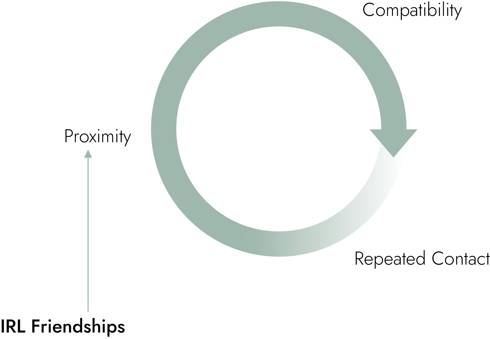
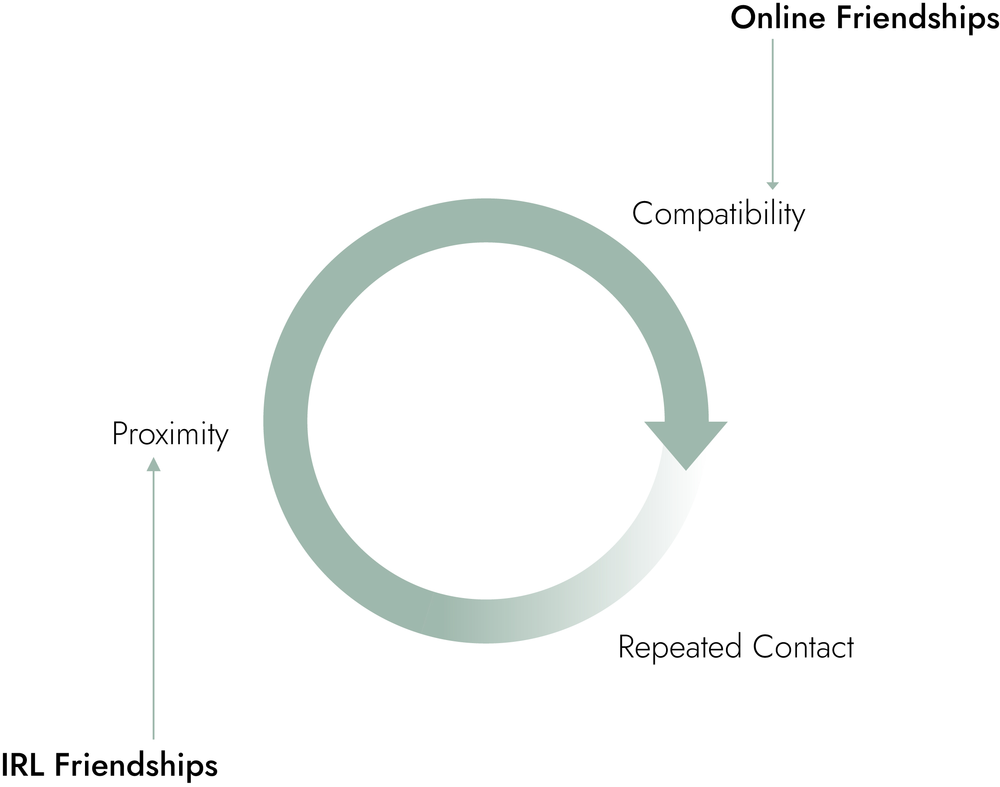

Most friendships in real life nowadays start as a result of **proximity** and, to some degree, convenience.

Same freshman year dorm, same team at work, same French class. I'll let you do the mental gymnastics with your own friend group, but I'm sure you get the point.

We run this initial set of people through a **compatibility** filter across hobbies, passions, major, humor, EQ, and anything else you value.

The final stage to this cycle is **repeated contact**. Once you have a reason to see each other at some frequency it's the beginning of your friendship IRL.

The way that people meet is evolving. The age of "Don't trust strangers online" is dying and online friendships are blooming.

Most online friendships are a result of **compatibility** first, meeting through shared hobbies, thought circles, or interest groups on social media.

It's much easier to have **repeated contact** than in real life because of higher availabiity, communication can be asynchronous, and, assuming you're trying to build a brand, you're both producing content at regular frequencies.

The final step here is **proximity** which happens... well, whenever you want it to. Whether it's a meetup for your specific niche, coordinated plans to hang out, or you take that leap of faith and moving across the country for that person you've never met but talk to online everyday.

It's [happened before](https://www.reddit.com/r/wow/comments/7ip3ku/couples_of_warcraft_whats_your_story_of_how_you/), not as crazy as you may think.

Give it a few years, we'll all have online best friends we've never met in person.
