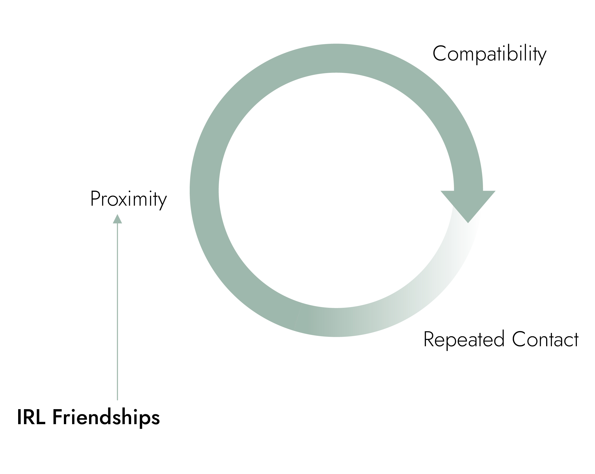
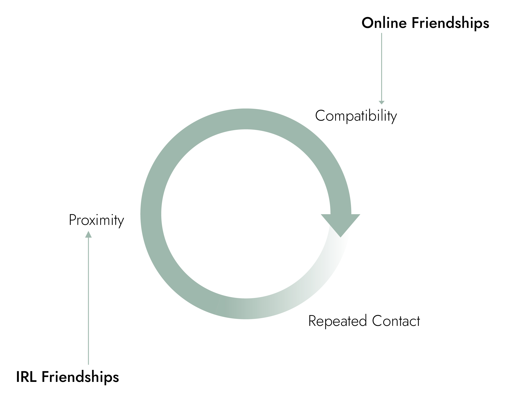

### Friendships IRL

Most friendships in real life nowadays are a direct result of **proximity** and, to some degree, convenience.

Same Freshman year dorm, same team at work, same French class. I'll let you do the mental gymnastics with your own friend group, but you get the point.

We run this initial set of people through a **compatibility** filter across hobbies, passions, major, humor, EQ, and anything else you value.

The final stage to solidify a friendship, and the cycle is **repeated contact**. Its familiarity and trust that allows us to open up even further and continue to learn about each other to strengthen a friendship.

### Online Friendships

The way that people meet is evolving. The age of "Don't trust strangers online", sorry mom, is coming to an end and online friendships are beginning to blooming.

They start differently though and tend to be a result of **compatibility** and shared interest first.

Meeting playing the same video game, having the same hobby, or joining interest groups that entertaining similar thoughts on social media.

It's much easier to have **repeated contact** than in real life because of higher availabiity, communication can be asynchronous, and, assuming you're passionate about the hobby that connected you both, you'll continue to cross paths.

The final step here is **proximity** which happens... well, whenever you want it to. Whether it's a meetup for your specific niche, coordinated plans to hang out, or you take that leap of faith and moving across the country for that person you've never met but talk to online everyday.

It's happened on World of Warcraft often enough. So much so that there's an entire [reddit thread](https://www.reddit.com/r/wow/comments/7ip3ku/couples_of_warcraft_whats_your_story_of_how_you/) dedicated to it, maybe not as crazy as you may think.

Give it a few years, having a best friend you've never met before will become the norm.

### Inspiration

This idea was inspired after seriously getting into [photography](https://www.instagram.com/francistogram/) over the last year and the photography community I've met entirely through Instagram and after talking to my friend [Venus](https://twitter.com/vnusw) who shared a similar experience while launching her sticker design shop [PoofyLuffy](https://www.instagram.com/poofyluffy/).
